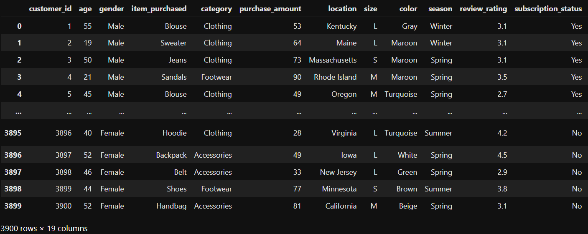

# 🛒 Customer Shopping Behavior Analysis

## 📌 Project Overview

This project analyzes customer shopping behavior using transactional data to discover patterns in purchasing habits, customer preferences, product performance, and revenue trends.

The project follows a complete data analytics workflow using **Python, SQL, and Power BI** to convert raw customer data into meaningful business insights.

---

## 🎯 Project Objectives

- Understand customer purchasing patterns
- Analyze revenue and sales trends
- Identify valuable customer segments
- Study product performance
- Analyze the impact of discounts and subscriptions
- Build an interactive dashboard for decision-making

---

## 🛠️ Tools & Technologies

- 🐍 Python
  - Pandas
  - NumPy
  - Matplotlib
  - Seaborn

- 🗄️ SQL
  - PostgreSQL

- 📊 Power BI

- 📒 Jupyter Notebook

---

# 🔄 Project Workflow

Data Collection
↓
Data Cleaning & Preprocessing
↓
Exploratory Data Analysis
↓
SQL Business Analysis
↓
Power BI Dashboard
↓
Business Insights

---

# 📂 Dataset Information

The dataset contains customer transaction details including:

- Customer demographics
- Product information
- Purchase amount
- Category
- Review ratings
- Discount usage
- Shipping method
- Subscription status

### Dataset Size

- Rows: 3900
- Columns: 18

## Dataset Preview

(Add Dataset Screenshot Here)

---

# 🧹 Data Cleaning & Preprocessing

The following steps were performed:

✅ Checked missing values  
✅ Handled missing data  
✅ Standardized column names  
✅ Checked data consistency  
✅ Created new features  
✅ Prepared data for analysis  

### Feature Engineering

Created additional features:

- Age Groups
- Customer Segments
- Purchase Behaviour Categories

(Add Python Code Screenshot Here)

---

# 📊 Exploratory Data Analysis (EDA)

EDA was performed to understand:

## Customer Analysis

- Customer distribution
- Spending behaviour
- Revenue contribution

## Product Analysis

- Best-selling products
- Highest-rated products
- Category performance

## Sales Analysis

- Discount impact
- Shipping preferences
- Purchase trends

(Add EDA Charts Here)

---

# 🗄️ SQL Business Analysis

After cleaning, the data was loaded into PostgreSQL for business analysis.

Questions explored:

- Which gender contributes more revenue?
- Who are the high-value customers?
- Which products have the best ratings?
- Does subscription affect spending?
- Which products depend heavily on discounts?

(Add SQL Query Screenshot Here)

---

# 📈 Power BI Dashboard

An interactive dashboard was created to visualize important insights.

Dashboard Includes:

- Total Revenue
- Average Purchase Amount
- Customer Segmentation
- Product Analysis
- Subscription Analysis
- Sales Trends

(Add Power BI Dashboard Screenshot Here)

---

# 💡 Key Insights

Some major findings:

- Customer segments show different purchasing patterns
- Repeat customers contribute significantly to revenue
- Discounts influence buying decisions
- Subscription customers provide growth opportunities
- Popular and highly rated products can be prioritized

---

# 🚀 Business Recommendations

Based on the analysis:

- Create loyalty programs for repeat customers
- Use personalized marketing campaigns
- Optimize discount strategies
- Promote high-performing products
- Improve customer retention strategies

---

# 📁 Project Structure

Customer-Shopping-Behavior-Analysis/

│
├── Dataset/
│ └── customer_data.csv
│
├── Python/
│ └── analysis.ipynb
│
├── SQL/
│ └── queries.sql
│
├── PowerBI/
│ └── dashboard.pbix
│
├── Report/
│ └── project_report.pdf
│
├── Images/
│ ├── dataset.png
│ ├── eda.png
│ ├── sql.png
│ └── dashboard.png
│
└── README.md

---

## 👨‍💻 Author

**Adeel Umar**

Data Analyst  
Skills: Python | SQL | Power BI | Machine Learning
